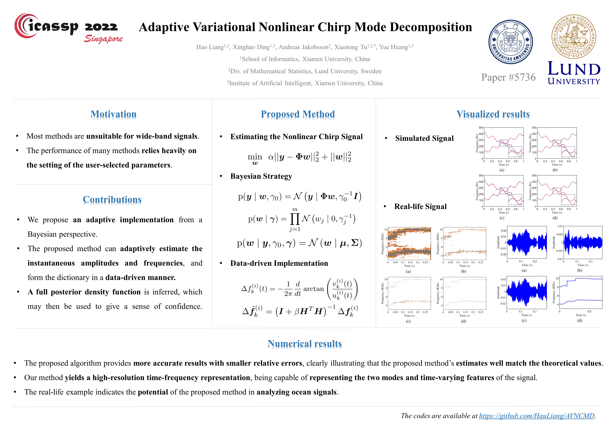

# AVNCMD
MATLAB code for "Adaptive Variational Nonlinear Chirp Mode Decomposition".

If you use the code, please cite our paper:
> [Liang, Hao and Ding, Xinghao and Jakobsson, Andreas and Tu, Xiaotong and Huang, Yue. "Adaptive Variational Nonlinear Chirp Mode Decomposition", in *2022 IEEE International Conference on Acoustics, Speech and Signal Processing (ICASSP)*, 2022.](https://ieeexplore.ieee.org/abstract/document/9746147 "https://ieeexplore.ieee.org/abstract/document/9746147")

## Poster
 

@ All rights are reserved by the authors.
